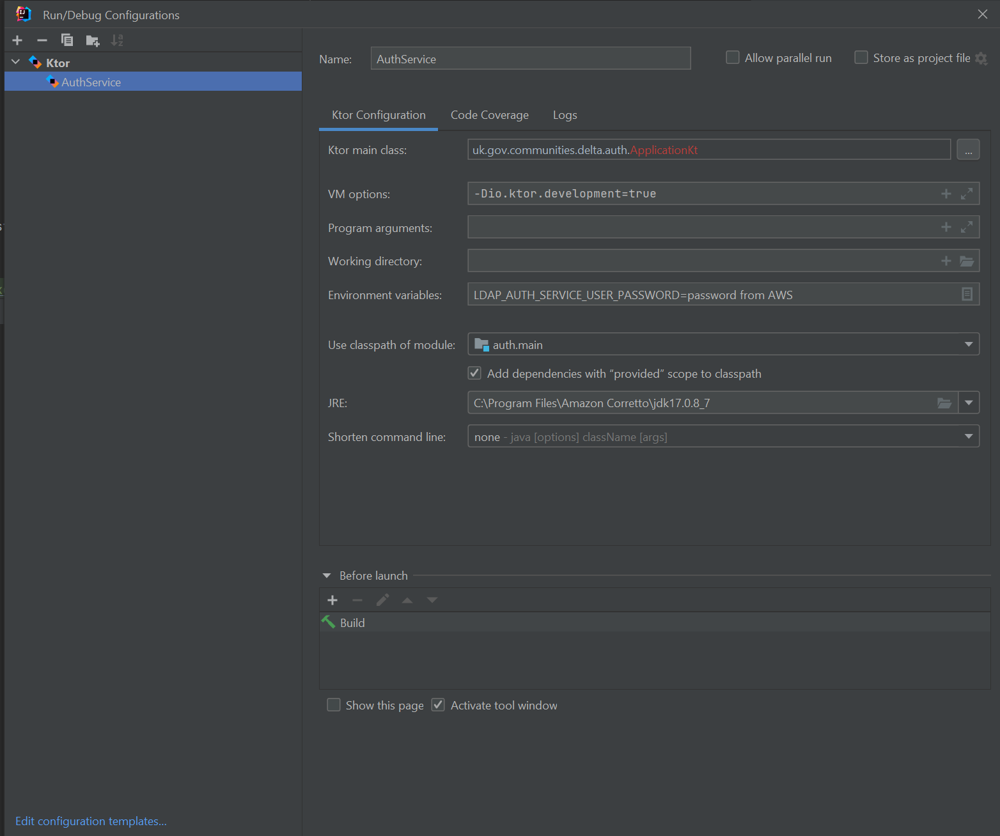

# Auth service

## Setup

* Requires Java 17
* Forward localhost:2636 to port 636 of the test environment Active Directory,
  see the delta-common-infrastructure repository for details of the bastion host,
  and delta for port forwarding commands
* Copy `.env.template` to `.env` and fill in the uncommented variables as instructed in that file
* Postgres, by default on port 5438, use `docker compose up -d`
* Add LDAPS CA certificate to your certificate store (we have to use LDAPS for password resets)
    * Run this on your local machine. The `keytool` command will need to be run as admin (Windows) or with sudo (MacOS).
    ```sh
    curl "https://data-collection-service-ldaps-crl-test.s3.eu-west-1.amazonaws.com/CASRVTEST2/CASRVtest2.dluhctest.local_CASRVtest2.crt" -o dluhctest.crt
    openssl x509 -inform der -in dluhctest.crt -outform pem -out dluhctest.pem
    keytool -import -cacerts -alias dluhctest -file dluhctest.pem -noprompt -storepass changeit
    ```
    * If the `-cacerts` option doesn't work, specify the correct cacerts file for the Java version you are using,
    by replacing it with e.g. `-keystore "C:\Program Files\Amazon Corretto\jdk17.0.16_8\lib\security\cacerts"` (Powershell).
* We need to force the "dluhctest.local" domain to resolve to localhost, so it goes through the SSH tunnel.
    * Add the following to your hosts file (Windows: `C:\Windows\System32\Drivers\etc\hosts`, MacOS: `/etc/hosts`):
      ```plaintext
      127.0.0.1 dluhctest.local
      ```
    * If tunneling into the staging environment, you will need a line for `dluhcdata.local` as well
 
## Run

Open in IntelliJ, add this folder as a Gradle module, then create a new Ktor run configuration
with `uk.gov.communities.delta.auth.ApplicationKt` as the main class and environment variables set from `.env`. (See
below image for an example)



Set the `io.ktor.development` property to `true` (`-Dio.ktor.development=true` JVM arg) to enable development mode (
faster restarts, reloading of templates).

### Tests

* `./gradlew test`
* Postgres must be running

## Running from a terminal

```shell
./gradlew run
```

or in PowerShell

```powershell
.\gradlew.bat run
```

Note that Gradle will still say "EXECUTING", but the logs say "Application started" the app will be running on port 8088.
The `io.ktor.development` property is automatically set when using gradle run.

### Metrics

To run locally with AWS metrics set the `AUTH_METRICS_NAMESPACE` and start the app with AWS credentials.
For example:

```shell
AUTH_METRICS_NAMESPACE="localYourName/AuthService" aws-vault exec <profile> -- ./gradlew run
```

### Tracing

Tracing is disabled locally by default, to enable it uncomment and fill in the values in .env.template,
then start the collector.

```shell
docker compose --profile tracing up
```

### Migrations

Database migrations are run automatically when the database connection is first initialised by the app.
You can also run only the migrations without starting the app:

```shell
./gradlew migrate
```

### Scheduled tasks

You can run a task locally by setting the RUN_TASK environment variable and using the "runTask" gradle task, for example

```shell
RUN_TASK=DeleteOldAuthCodes ./gradlew runTask
```

In hosted environments scheduled tasks are run using AWS EventBridge Scheduler,
which invokes an ECS task with the RUN_TASK environment variable set, and the
Docker [entrypoint script](./entrypoint.sh)
will execute the task instead of starting the application.

Tasks can also be manually started using the run-scheduled-task.sh script in this repository:

```shell
aws-vault exec <profile> -- bash ./scripts/run-scheduled-task.sh test DeleteOldAuthCodes
```

## Example requests

### Generate SAML token

Replace `<delta-app-password>` with the value of delta-website-ldap-password-test from AWS Secrets Manager.

```shell
curl -X POST 'http://localhost:8088/auth-internal/service-user/generate-saml-token' \
  -u 'delta.app:<delta-app-password>' \
  --header 'Delta-Client: marklogic:dev-marklogic-client-secret'
```

### OAuth flow

Users sign in to Delta via the auth service.
We use the [OAuth 2 Authorization Code flow](https://datatracker.ietf.org/doc/html/rfc6749#section-4.1)
which allows us to use a standard OAuth client library in Delta.

#### 1. Login Redirect

Delta redirects unauthenticated users to the auth
service `http://localhost:8088/delta/login?response_type=code&client_id=delta-website-dev&state=1234`
(use `client-id=delta-website` for non-dev environments).

The user will be shown a login page and provide a username and password as a standard form submission,
or with Single Sign On through Azure AD if configured.

#### 2. Authorization code redirect

The user's credentials are validated by performing an LDAP bind against AD.
The auth service will then redirect the user back to delta with an authorization code
`http://delta/login/oauth2/redirect?code=4321&state=1234`.

#### 3. Code exchange

Delta uses the internal API to exchange that code for a token.
Note that the code is only valid for a short time.

```sh
curl -X POST 'http://localhost:8088/auth-internal/token' \
  -d "code=4321&client_id=delta-website-dev&client_secret=dev-delta-website-client-secret"
```

The auth service will respond with an access token and information about the user.

```json
{
  "access_token": "ABC123",
  "delta_ldap_user": {
    "cn": "delta.admin",
    "memberOfCNs": [
      "datamart-delta-dataset-admins",
      "datamart-delta-data-providers"
    ],
    "email": "delta.admin",
    "deltaTOTPSecret": "ABC987",
    "name": "Delta Admin"
  },
  "saml_token": "token",
  "expires_at_epoch_second": 1690327542,
  "token_type": "bearer",
  "expires_in": "43200"
}
```

#### 4. Refresh user info

If required Delta can get updated user info without repeating the login flow using
the `/auth-internal/bearer/user-info` endpoint.

```sh
curl 'http://localhost:8088/auth-internal/bearer/user-info' \
  --header 'Authorization: Bearer ABC123' \
  --header 'Delta-Client: delta-website-dev:dev-delta-website-client-secret'
```

The response is similar to above, though the access token is not repeated.

### Authenticating with the Delta API

#### Obtaining an API token

This endpoint requires authenticating with a valid AD username and password, and also a valid client id and secret combination. If running locally an id and secret must be added manually to the database. The test auth service DB contains `dev` and `dev` as an ID and secret pair. The stage auth service DB contains an id `dev-client` and a secret that can be found in AWS by the name `auth-service-dev-api-client-secret-staging`. When testing on test or stage, the domain should be replaced as appropriate. The origin domain should be `api.delta.[environment].communities.gov.uk`.

```sh
curl --request POST 'http://localhost:8088/delta-api/oauth/token' \
--header 'Content-Type: application/x-www-form-urlencoded' \
--header 'Origin: http://localhost:8080' \
--data-urlencode 'grant_type=password' \
--data-urlencode 'client_id=<client-id>' \
--data-urlencode 'client_secret=<client-secret>' \
--data-urlencode 'username=<username>' \
--data-urlencode 'password=<password>'
```

The `Origin` header checks that Swagger will work.

#### Exchanging an API token

Once obtained, the API token can be exchanged for a SAML token. This request is normally performed by the delta API gateway (`/api/gateway` in Delta repo), not by the local authority or swagger.

```sh
curl --request POST 'localhost:8088/internal/delta-api/validate' \
--header 'Content-Type: application/json' \
--header 'Delta-Client: delta-api:<client-secret>' \
-d '{"token": "<token>"}' -v
```

If running locally, the client secret can be set with the `CLIENT_SECRET_DELTA_API` environment variable or the default value from `ClientConfig.kt` can be used. If testing remotely, the secret is stored in AWS under the name `tf-[environment]-delta-api-client-secret`

### Other endpoints that accept bearer tokens

#### Get user audit trail

```sh
curl 'http://localhost:8088/auth-internal/bearer/user-audit?cn=delta.admin' \
  --header 'Authorization: Bearer ABC123' \
  --header 'Delta-Client: delta-website-dev:dev-delta-website-client-secret'
```

#### Update user's own roles

```sh
curl -X POST 'http://localhost:8088/auth-internal/bearer/roles' \
  --header 'Authorization: Bearer ABC123' \
  --header 'Delta-Client: delta-website-dev:dev-delta-website-client-secret' \
  -d '{"addToRoles": ["data-providers"], "removeFromRoles": []}'
```

## GOV.UK Frontend

We use the [GOV.UK Frontend](https://frontend.design-system.service.gov.uk/) design system.

For simplicity, we copy the precompiled files rather than using npm.

To update them:

* See <https://frontend.design-system.service.gov.uk/install-using-precompiled-files/> for general instructions and
  download links
* Download the updated bundle and replace the existing files, following the folder structure in this repo. They can be found in `auth-service/src/main/resources/static`
* Find and replace in the CSS file to change links to "/assets/" to "/static/assets/"
* Update the version numbers linked from the HTML header (`auth-service/src/main/resources/templates/thymeleaf/fragments/template.html`)

## Coroutines and Ktor

Kotlin uses [Coroutines](https://kotlinlang.org/docs/coroutines-overview.html) for parallel and asynchronous work,
rather than an OS thread per-request that you might be familiar with from e.g. Spring Web.

The Ktor framework uses the Default dispatcher for processing requests which only has one thread per CPU core.
That means if a small number of requests are doing blocking IO that's it, nothing else can progress.
It's therefore important that any blocking calls happen on another thread, there's an IO dispatcher for this, i.e.

```kotlin
withContext(Dispatchers.IO) {
    // Blocking call, e.g. database query
}
```
